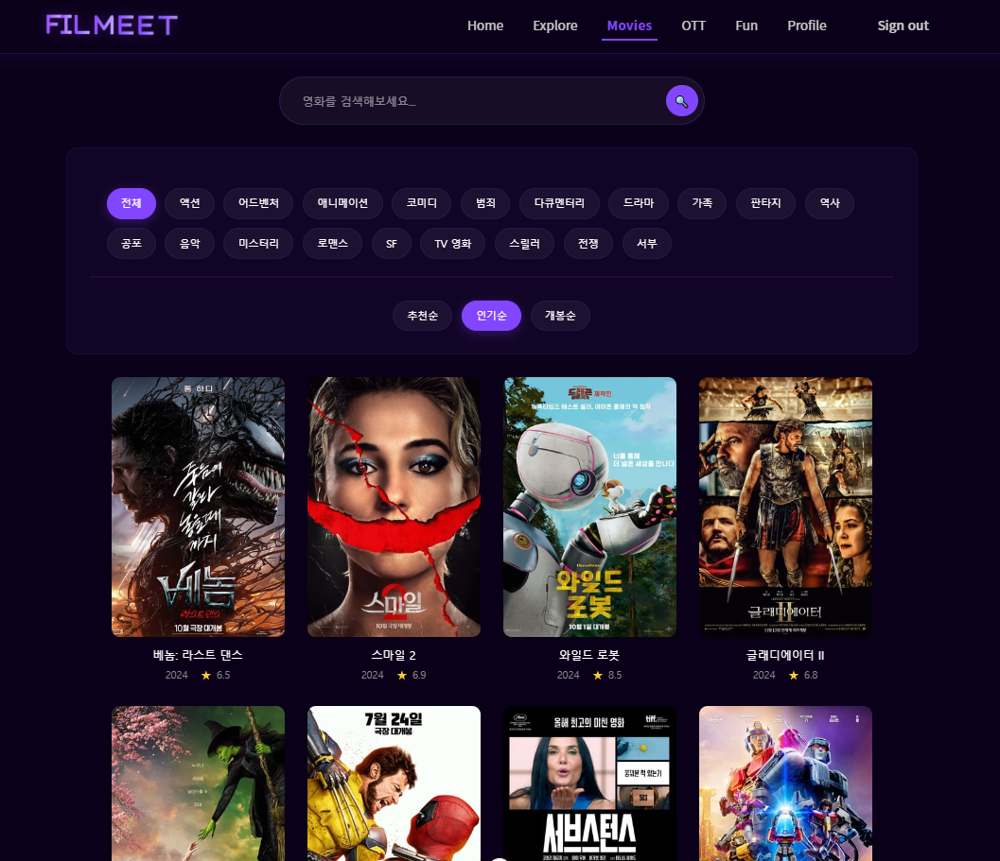

# 🎬 FILMEET Project
## 🏆 삼성 청년 SW 아카데미 1학기 프로젝트 최우수상 🏆
> FILMEET은 넘쳐나는 OTT 서비스 속에서 사용자들의 취향에 맞는 영화를 추천해주고, 영화에 대한 정보와 의견을 공유할 수 있는 플랫폼입니다. 
AI 기반 추천 시스템과 사용자 맞춤형 OTT 플랫폼 추천으로 "오늘 뭐 볼까?"에 대한 고민을 해결해드립니다.

## 📆 프로젝트 기간
2024.11.18 ~ 2024.11.26

## 👩‍💻 Contributors
| 이름 | 담당 |
|------|------|
| 강지민 | - DB 모델링 - 회원 관련 기능 구현  - OTT 추천 기능 구현 - 배우 이상형 월드컵 구현 |
| 강현호 | - 전체적인 CSS 관리 - 영화/감독/배우 정보 제공 기능 구현 - AI 추천 기능 구현 - 커뮤니티 기능 구현 |

## 📚 Stack
- Python 3.9
- Django 4.2.16
- Vue3
- SQLite3

## 📑 프로젝트 명세
### 요구사항 명세서
[FILMEET_요구사항 명세서](https://docs.google.com/spreadsheets/d/1RPJ6wWmQvm0Ek8UGUu_yLZ4NdXj5c2ymKTp8VdeOEfg/edit?pli=1&gid=0#gid=0)

### ERD

[FILMEET_ERD](https://www.erdcloud.com/d/sitRo5xSoiHuuWcPg)

### API 명세서
[FILMEET_API 명세서](https://docs.google.com/spreadsheets/d/13AOHZ2Lixjs-AKKyxBSqtr7EGBxUydlzRa5THYE8lbk/edit?gid=0#gid=0)

### Figma

## 📌 주요 기능
### accounts
#### [아이디 & 비밀번호 찾기]

- 가입한 이메일을 입력하면 아이디 및 비밀번호 찾기 가능
- 비밀번호의 경우 사용자의 이메일로 임시 비밀번호 발급
- 유효하지 않은 이메일의 경우 오류 메시지 출력

#### [마이페이지]

- 내 정보 수정 및 비밀번호 변경 가능
- 회원 탈퇴 기능
- 유저가 찜한 영화, 배우, 감독 목록 확인 가능

### movies
#### [영화 검색]

- 원하는 영화 검색 가능
- 장르별 추천순/인기순/개봉순으로 정렬 가능

#### [영화 상세 페이지]

- 상세 정보 클릭 시 제목, 줄거리, 감독 및 배우 정보 등 영화 상세 정보 확인 가능
- 유튜브를 이용하여 포스터 클릭 시 예고편 영상 제공

#### [배우 및 감독 상세 페이지]

- 배우 및 감독 프로필 조회 시 각종 정보 및 Filmography 제공
- 사용자가 좋아하는 배우나 감독을 찜하여 관련 영화를 제공받을 수 있도록 함

#### [OTT 추천]

- 사용자가 찜한 영화 목록을 기반으로 OTT 추천
- 찜한 영화의 개수가 같을 경우 낮은 가격을 우선 추천

#### [배우 이상형 월드컵]

- 유저의 재미 요소를 위한 배우 이상형 월드컵
- 우승 배우 및 출연 영화 찜하기 가능

#### [AI 영화 추천]

- AI를 활용한 키워드 기반 영화 추천
- 찜한 영화 제외 가능
- 추천 결과 상세 정보 보기 및 찜하기 가능

### community
#### [영화 토론의 장]

- 각 영화마다 유저들 간의 의견 공유를 위한 채팅 창 마련
- 스팸/비방/스포일러 등 채팅 신고 가능
- 스포일러의 경우 댓글 숨기기

## 💡 느낀점
### 🐶 지민
> 팀원과 함께 피그마를 활용한 UI 디자인 과정이 처음에는 어렵게 느껴졌지만, 다양한 디자인을 살펴보고 더 나은 디자인을 고민하는 과정에서 큰 재미를 느꼈습니다. 또한 프로젝트의 성공을 위해서는 초반의 기획 작업이 매우 중요하다는 것을 깨달았습니다. 요구사항 분석, ERD 설계, UI 디자인 등의 체계적인 준비 과정이 없었다면 후반부에 큰 어려움을 겪었을 것 같습니다. 특히 팀원과의 원활한 소통이 문제 해결의 핵심이었음을 배웠습니다. 혼자 고민할 때보다 서로의 어려움을 공유하고 함께 해결책을 모색하는 것이 훨씬 효율적이었습니다. 프로젝트를 진행하면서 코드를 지속적으로 수정하고 개선하는 과정에서 "사용자에게 더 편리한 사이트는 무엇일까?"라는 고민을 계속하게 되었고, 이는 매우 값진 경험이 되었습니다. 첫 프로젝트인 만큼 앞으로 진행할 프로젝트들을 위한 소중한 경험과 교훈을 얻을 수 있었습니다.

### 🐹 현호
> 처음에는 요구사항 분석의 필요성을 의심했지만, 프로젝트를 진행하면서 이 과정이 없었다면 프로젝트의 방향성이 크게 벗어날 수 있었다는 것을 깨달았습니다. 프로젝트의 각 단계가 모두 의미 있는 이유가 있다는 것을 이해하게 되었습니다. HTML에 대한 더 깊은 학습이 필요했다는 아쉬움이 들었고, 이를 통해 프론트엔드 개발자로서의 가능성도 고민해 보게 되었습니다. 특히 View 컴포넌트의 복잡한 코드 구조에 대한 정리의 필요성을 느꼈습니다. 프로젝트를 진행할수록 더 많은 기능을 추가하고 싶은 욕심이 생겼고, 완성 후에는 큰 뿌듯함을 느꼈습니다. 앞으로 코드 리팩토링을 진행하고 실제 서비스로 배포해 보고 싶은 새로운 목표도 생겼습니다.

## 😊 잘한 점
- 초기 설계 작업으로 프로젝트의 방향성을 명확히 함
- 사용자를 위한 편의 기능 추가
- 초반에 기획한 기능들을 모두 완성시킴
- 커버 페이지/엔딩 페이지 등 부가적 요소 추가로 재미 요소 강화

## 😓 추후 개선 사항
- 반응형 미지원 페이지 개선 필요
- 채팅 목록 시간순 정렬 수정
- Explore/Movies 통합
- 컴포넌트 분리 작업
- 전체적인 CSS 수정
- 코드 재사용성 개선
